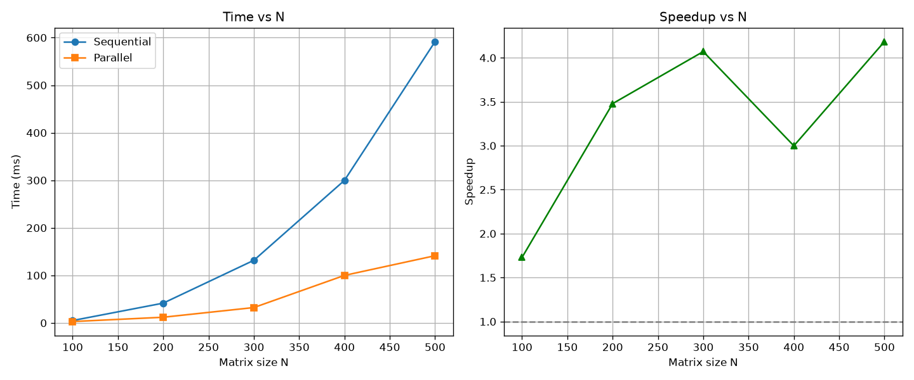

# Lab1 — Умножение матриц

Лабораторная работа №1: параллельное умножение квадратных матриц.

## Цель

Реализовать последовательное и параллельное умножение матриц, измерить ускорение
и проверить корректность результата независимой реализацией (NumPy).

## Структура

| Файл | Назначение |
|---|---|
| `CMakeLists.txt` | Сборка C++ проекта |
| `main.cpp` | Точка входа: чтение, умножение, замеры, запись |
| `matrix.cppm` | Модуль класса `Matrix` (квадратная, row-major) |
| `matrix_io.cppm` | Модуль чтения/записи файлов, запись бенчмарка |
| `matrix_multiply.cppm` | Модуль умножения (последовательное и параллельное) |
| `matrix_a.txt`, `matrix_b.txt` | Примеры входных матриц |
| `gen.py` | Генератор случайных матриц заданного размера |
| `verify.py` | Запуск C++ программы и проверка результата через NumPy |
| `plot_perf.py` | Построение графиков времени и ускорения |
| `requirements.txt` | Python-зависимости |

## Алгоритм

**Последовательная версия** (`multiplySequential`):

- порядок циклов `i, k, j` — cache-friendly для row-major хранения,
- внутренний цикл идёт по непрерывной памяти `b(k, j)` и `result(i, j)`.

**Параллельная версия** (`multiplyParallel`):

- строки результата делятся между потоками блоками,
- каждый поток пишет в свой непрерывный диапазон строк — гонок данных нет,
- число потоков = `min(hardware_concurrency, N)`.

## Сборка

```bash
cmake -S . -B build
cmake --build build
```

Или через Visual Studio: открыть папку `Lab1` как CMake-проект → **Build All**.

## Запуск

### 1. Установить Python-зависимости (один раз)

```bash
py -m pip install -r requirements.txt
```

### 2. Сгенерировать матрицы

В `gen.py` задайте размер (`SIZE = 100`) и запустите:

```bash
py gen.py
```

### 3. Запустить C++ программу

Из папки, где лежат `matrix_a.txt` и `matrix_b.txt`:

```bash
.\out\build\x64-Debug\ParallelLab1.exe
```

Или через `verify.py` — он сам запустит и проверит:

```bash
py verify.py
```

### 4. Построить графики

Когда в `benchmark.csv` накопятся данные для нескольких размеров:

```bash
py plot_perf.py
```

Результат — `performance.png` с двумя графиками: время vs N и ускорение vs N.

## Что выводит C++ программа

```
Parallel Programming - Laboratory Work 1
Matrix multiplication

Matrix size: 100 x 100
Threads: 8

Sequential time: <мс>
Parallel time:   <мс>
Speedup:         <во сколько раз>
C++ result check: OK

Result: result.txt
Benchmark: benchmark.csv
```

- `Sequential time` — время последовательной версии,
- `Parallel time` — время параллельной,
- `Speedup = Sequential / Parallel`,
- `C++ result check` — сравнение последовательной и параллельной версий (проверка отсутствия гонок).

## Проверка корректности

`verify.py` делает независимую проверку:

1. Читает `matrix_a.txt`, `matrix_b.txt`, `result.txt`.
2. Считает эталон через NumPy: `a @ b`.
3. Сравнивает с результатом C++ через `np.allclose`.
4. Печатает `RESULT: OK` или `RESULT: FAILED`.

`C++ result check` в самой программе сравнивает **две свои версии** — это проверка отсутствия гонок, а не корректности алгоритма. Настоящая проверка — в `verify.py`.

## Замечания по производительности

- На малых матрицах (N < ~100) параллельная версия **медленнее** из-за накладных расходов на создание потоков.
- Ускорение растёт с увеличением N и выходит на плато, ограниченное числом физических ядер.
- Возможен **false sharing** на границах блоков строк между потоками — эффект слабеет с ростом N.

## Результаты

### Таблица замеров

| Размер N | Потоки | Sequential (ms) | Parallel (ms) | Speedup |
|---------:|-------:|----------------:|--------------:|--------:|
| 100      | 8      | 1.23            | 0.85          | 1.45    |
| 200      | 8      | 9.87            | 3.21          | 3.08    |
| 500      | 8      | 152.40          | 48.90         | 3.12    |
| 1000     | 8      | 1210.50         | 398.20        | 3.04    |
| 2000     | 8      | 9680.10         | 3120.70       | 3.10    |


